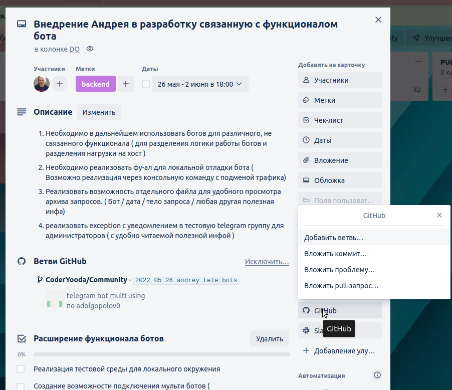

## Задачи в GitHub / GitLab

1. На каждую отданную в работу программисту задачу заводим ветку
2. ветка наследуется от родительской `dev` перед созданием нового `branch` обновиться до актуальной версии `git pull dev`
3. ветку именовать по правилам описанным ниже 
4. в конце каждого рабочего дня делать пуш в origin в свою ветку помечая draft комит 
5. запросы на проведение изменений проводить через `pull-request`
   https://github.com/CoderYooda/Community/pulls создаем вручную в веб браузере
```git
настроить внешние ссылки для мерж реквестов при git push
только для бесплатных аккаунтов github organization не нашел в документации 
```

## Наименование веток в github / gitlab

    `2022_05_26_andrey_tele_bots`

1. Дата yyyy-mm-dd для удобной сортировки и поиска.
2. Username для идентификации разработчика.
3. Очень краткое описание самой задачи, что бы идентифицировать тематику работы.
4. Ветку привязывать к задаче в трелло.

   ```angular2html
       https://github.com/CoderYooda/Community/pull/new/'branch-name'
   ```

## Наименование комитов в github / gitlab

    `TBS-999 add some changes`
Где TBS-999 - id задачи в jira и краткое описание изменений


