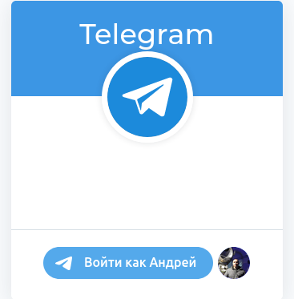

## Полезная литература и статьи
[Limits](https://skybots.ru/telegram-limity/?ysclid=l8bghcslr9780385652)
[Что может бот](https://habr.com/ru/post/543676/?ysclid=l8bjydo8hs17956581)
[еще лимиты](https://skybots.ru/telegram-limity/?ysclid=l8bghcslr9780385652)https://limits.tginfo.me/ru-RU


## Описание команд для работы с ботом телеграмма
```php

$deleteWebhook = 'https://api.telegram.org/bot5352050869:AAEIYvbTquj8mGEjZrsuonLfhR0uZzAaKxk/deleteWebhook?url=https://test1.spodial.com/bot/webhook';
$setWebhook = 'https://api.telegram.org/bot5352050869:AAEIYvbTquj8mGEjZrsuonLfhR0uZzAaKxk/setWebhook?url=https://test1.spodial.com/bot/webhook';
$getWebhookInfo = 'https://api.telegram.org/bot5352050869:AAEIYvbTquj8mGEjZrsuonLfhR0uZzAaKxk/getWebhookInfo';

$deleteWebhookKN = 'https://api.telegram.org/bot5552498089:AAGnrPSuHur9Pwkvvc9K26MBSVtGO8j3Quc/deleteWebhook?url=https://test1.spodial.com/bot/knowledge-webhook';
$setWebhookKN = 'https://api.telegram.org/bot5552498089:AAGnrPSuHur9Pwkvvc9K26MBSVtGO8j3Quc/setWebhook?url=https://test1.spodial.com/bot/webhook-knowledge';
$getWebhookKNInfo = 'https://api.telegram.org/bot5552498089:AAGnrPSuHur9Pwkvvc9K26MBSVtGO8j3Quc/getWebhookInfo';


$getMe = 'https://api.telegram.org/bot5352050869:AAEIYvbTquj8mGEjZrsuonLfhR0uZzAaKxk/getMe';
```


```telegramm
@BotFather
/mybots
выбрать или создать бота
Bot settings -> domain -> set domain
в тестовом поле ввода передать домен своего сервера "https://test1.spodial.com" 
результат  "Success! Domain updated."
```




## HTML style

To use this mode, pass HTML in the parse_mode field. The following tags are currently supported:

```html
<b>bold</b>, <strong>bold</strong>
<i>italic</i>, <em>italic</em>
<u>underline</u>, <ins>underline</ins>
<s>strikethrough</s>, <strike>strikethrough</strike>, <del>strikethrough</del>
<span class="tg-spoiler">spoiler</span>, <tg-spoiler>spoiler</tg-spoiler>
<b>bold <i>italic bold <s>italic bold strikethrough <span class="tg-spoiler">italic bold strikethrough spoiler</span></s> <u>underline italic bold</u></i> bold</b>
<a href="http://www.example.com/">inline URL</a>
<a href="tg://user?id=123456789">inline mention of a user</a>
<code>inline fixed-width code</code>
<pre>pre-formatted fixed-width code block</pre>
<pre><code class="language-python">pre-formatted fixed-width code block written in the Python programming language</code></pre>
```
Please note:

    Only the tags mentioned above are currently supported.
    All <, > and & symbols that are not a part of a tag or an HTML entity must be replaced with the corresponding HTML entities (< with &lt;, > with &gt; and & with &amp;).
    All numerical HTML entities are supported.
    The API currently supports only the following named HTML entities: &lt;, &gt;, &amp; and &quot;.
    Use nested pre and code tags, to define programming language for pre entity.
    Programming language can't be specified for standalone code tags.


## Основные моменты

есть два класса, которые непосредственно хранят логику обработки данных из телеграма
```php
\App\Services\Telegram\MainComponents\MainBotEvents - новые методы через события
'newChatMember', // Добавление бота в уже существующую ГРУППУ
'newChatUser', // Регистрация нового пользователя в группе, создание телеграм-юзера(если еще нет)
'groupChatCreated', // Добавление бота в новую ГРУППУ
'chanelChatCreated', // Добавление бота в новый канал
'checkMember', // Событие назначения бота администратором в ГРУППЕ
'newChatPhoto', // Событие изменения или добавления фотографии группы или канала
'deleteChat', //  Событие удаления бота из чата или удаление чата
'newChatTitle', // Событие изменения названия группы или канала
"hearsAndWriting", //  Слушатель сообщений, возвращает текст, chatId, userId (если есть текст то может вызвать обработчик)
// методы событий с колбеком для обработки обсерверами
'isNewReplay', // событие новой реплики в чате
'isNewTextMessage', // новое текстовое сообщение, но не реплика
'isNewForwardMessageInBotChat' // пересылка forward сообщения в ЛЧ(личный чат) с ботом

\App\Services\Telegram\MainComponents\MainBotCommands - старые методы через команды встроенные в расширение

'startBot', // обработка команды /start
'startOnGroup', // обработка команды /start@botName
'getTelegramUserId',// /myid
'getChatId',// /chatId
'getChatType',// /type
'tariffOnUser',// /tariff
'setCommand',// инициализация команд у бота /setCommand (однократно служебная)
'tariffOnChat', // /tariff@botName
'inlineCommand', // хрен его знает что она делает
'donateOnChat',// возвращает меню кнопки с вариантами донатов /donate-1@botName
'donateOnUser',// примерно то же самое, только в ЛЧ с ботом /donate 
'materialAid',// реакция на фразу "❗Оказать материальную помощь"
'personalArea',// реакция на фразу '🚀Личный кабинет'
'faq',//  реакция на фразу '🔧Помощь'
'mySubscriptions',//  реакция на фразу '📂Мои подписки'
'subscriptionSearch',// реакция на фразу '🔍Найти подписку'
'setTariffForUserByPayId',// реакция на фразу 'payment-1213'
'knowledgeSearch',// поиск по Базе Знаний опубликованных вопросов /qa поисковая фраза
'saveForwardMessageInBotChatAsQA',// механизм выбора сообщества, если несколько у одного автора /add-qa-community-3
// в процессе добавления вопроса ответа через ЛЧ с ботом
'unsubscribe', // отписка от группы или канала /unsubscribe-1 отключение автоплатежа
'access', // /access-3  получение ссылки пригласительной к какой-либо группе
'extend', // какая-то дополнительная информация по группе(список тарифов и еще что-то) /extend-1 работает только при подписке

```