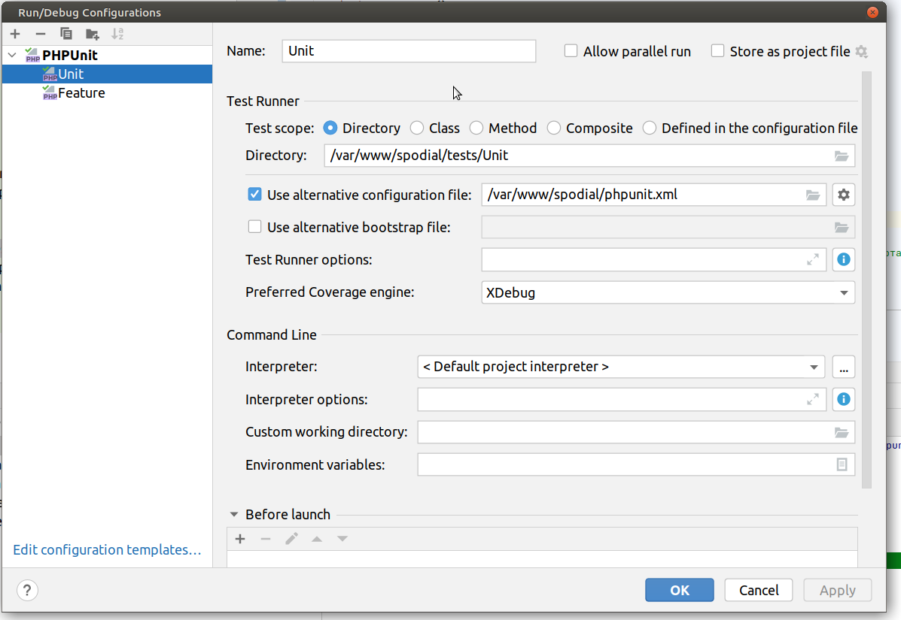

## Запуск тестов 

Из консоли в корне 

`php artisan make:test -u telegram/BotServiceTest` - создать тест в папке `tests/Unit/telegram` с именем `BotServiceTest`


после создания юнит теста наследовать его от `\Tests\BaseUnitTest`

`php artisan make:test models/UserTest` - создать тест в папке `tests/Feature/models` с именем `UserTest`

`php artisan test --filter BotServiceTest` - запустить только тест с именем `BotServiceTest`

Настройки для автотестов для phpstorm



## настройка совместного использования папкой разных user-ов linux

папке присваиваются права
775 user:www-data

```bash
sudo chmod 2775  storage/app/telegram
```

```bash
sudo chown $USER:www-data  storage/app/telegram
```

в апаче прописать маску 

```bash
sudo nano /etc/apache2/envvars
```

`umask 0002`

файлы будут создаваться под пользователем 
1. www-data с правами 664 из веба
2. user с правами 664 из консоли

обмен группами
```bash
sudo usermod -a -G $USER www-data
```
```bash
sudo usermod -a -G www-data $USER
```

при установке переменной среды 

`GRAB_TEST_DATA=true`

запуск консольной php строки для тестов

```bash
php artisan tinker
```
